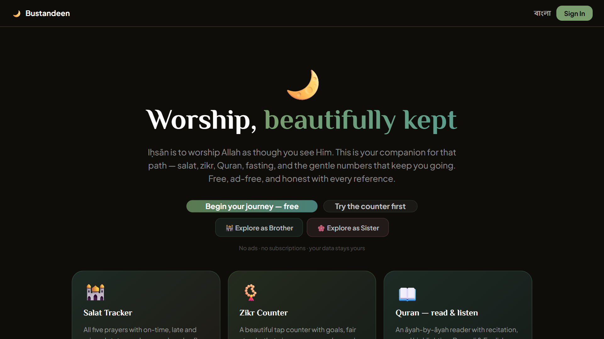

# 🌱 Bustandeen

**Nourish Your Deen.** A calm, ad-free companion for the Muslim day.

[**Open the app → bustandeen.com**](https://bustandeen.com/)

> _Iḥsān is to worship Allah as though you see Him._

Salat, zikr, Quran, fasting, prayer times, a private cycle room for sisters and a dedicated
Ramadan home, all in one place. Free, no ads, private by design, and honest with every
reference: each Quran verse and hadith links to quran.com or sunnah.com with its number and grade.

---

## ✨ Core features

|     | Feature                  | What it does                                                                                                                                                                     |
| --- | ------------------------ | -------------------------------------------------------------------------------------------------------------------------------------------------------------------------------- |
| 🕌  | **Salat Tracker**        | Five fard prayers (Done / Kaza / Miss), sunnah and nafl, jamāʿah and mosque, automatic kaza debt, streaks and analytics. Post-prayer tasbīḥ posts straight to your zikr counter. |
| 📿  | **Zikr Counter**         | Tap counter with focus mode, daily goals, a verified adhkār library, fair streaks with grace days, and charts. Works offline.                                                    |
| 📖  | **Quran**                | Āyah-by-āyah reader with tafsir, several reciters, khatam journey, **Hifz** (spaced repetition), bookmarks, reading sessions and one unified daily streak.                       |
| 🌙  | **Fasting**              | Fiqh-aware: qaḍā, kaffārah, vows and every sunnah fast. Blocks ḥarām days and warns on disliked ones, each rule cited.                                                           |
| 🌟  | **Ramadan**              | Countdown before the month, then a live home: suhoor and iftar countdown, tarawih, the three ashra, and Ramadan analytics.                                                       |
| 🕐  | **Prayer Times & Qibla** | Calculated on your device with country-aware defaults. Your location never leaves your browser. Qibla compass included.                                                          |
| 🧳  | **Musafir**              | Travel mode: qaṣr and jamʿ on the tracker, both madhab positions, journey duʿās, every concession cited.                                                                         |
| 🌸  | **Rayhanah**             | Cycle and nifās support for sisters. Salat and fasting pause without guilt, qaḍā days are counted for you. Encrypted, never shared, never sent to AI.                            |
| 🤝  | **Friends & Noor**       | Invite friends with one link and encourage each other with **Noor**, a calm daily measure of good deeds (Quran 2:148).                                                           |
| 💬  | **Naseeh**               | An optional AI companion for gentle encouragement. Never a source of rulings or evidence.                                                                                        |
| 💚  | **Sadaqah**              | Support the project and keep it free for everyone.                                                                                                                               |
| 📚  | **Library**              | Morning and evening adhkār, duʿās by situation, Asmāʾ ul-Ḥusnā, zakat calculator, Hijri converter and Ramadan calendars (English, বাংলা, العربية).                               |

### Built with care

- **Authentic sources only.** Every Quran and hadith reference is verified with its number and grade. Weak narrations are explained, never hidden.
- **A worship day, not a clock day.** The day turns at Fajr by default (or Midnight / Maghrib), so late Isha and suhoor land on the right day.
- **Installable and offline.** A PWA that installs on any phone or desktop, keeps working offline and syncs when you are back.
- **Private by design.** On-device prayer times, encrypted cycle data, full backup export and per-feature delete.
- **Light and dark themes**, plus a "daylight" mode that follows sunrise and Maghrib.

---

## 🧰 Tech stack

- **Frontend:** React 18 · TypeScript · Vite · Tailwind CSS + DaisyUI · Zustand · TanStack Query · Framer Motion · i18next · PWA (Workbox)
- **Backend:** Node.js · Express 5 · TypeScript · MongoDB Atlas (Mongoose) · Firebase Auth · Zod
- **Hosting:** Vercel (static site + one serverless API function) · prerendered SEO pages

Architecture, local setup and contributor notes: [**docs/README.md**](docs/README.md).

---

## 🤝 Contributing

Issues and pull requests are welcome. Any Quran or hadith addition must link to quran.com or
sunnah.com with the exact number and grade; if it cannot be verified, it does not ship.
Spotted a mis-cited reference in the app? Use the "Report it" link beside it.

## 📄 License

MIT

## 📧 Contact

**Istiak Islam** · [@isttiiak](https://github.com/isttiiak) · [bustandeen.com/contact](https://bustandeen.com/contact)

Built with ❤️ for the Muslim ummah.

